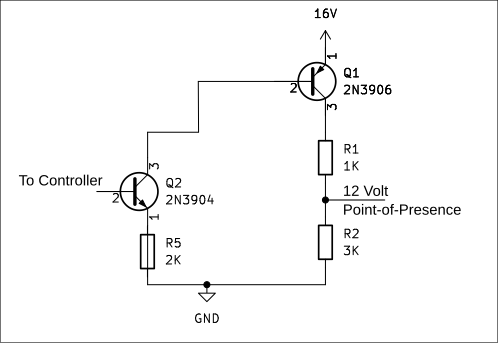

# Switched-Voltage-Divider
A microcontroller can switch a voltage divider on and off by means of a suitable PNP transistor placed on the *high-side* of the circuit. 

If the voltage on the high side of the circuit exceeds the tolerance of the microcontroller's I/O pin, then the PNP can be driven safely by a second, NPN transistor.

The circuit described in this article takes input from 16-volt DC power supply repurposed from a discarded laptop computer. 

The voltage divider gives a Point-of-Presence between the resistors where a 12-volt potential can be measured when the 16-volt power supply is enabled. I intend to apply this voltage in a future project for high-voltage parallel programming of AVR microcontrollers.

The circuit enables a 5-volt-tolerant I/O pin of an ATmega328P microcontroller to switch the 12-volt Point-of-Presence on and off.

Advantages and disadvantages for using transistors, rather than MOSFETs, will be discussed after describing the circuit. The article ends with an "honesty" section where I reveal some of my remaining ignorance and puzzlement regarding transistors.

### The Circuit
 
**Figure 1** Schematic Diagram

The diagram depicts an *unloaded* voltage divider. It satisfies requirements because the application in this case does not need to source any *current* at the 12-volt presence. It merely needs to sense the potential.

Q1 is a 2N3906 bipolar-junction PNP-type transistor. The emitter connects to the 16-volt power supply. The collector sources about 4 milliAmps of current into the 4K-Ohm voltage divider when the base voltage is pulled low.

>***Important!*** 
>When the base is pulled low (meaning, it has a path to ground), current will flow out of the PNP's base too, also at a voltage level of near 16 volts.
>
>This has the potential to cause two bad things to happen.
>
>The first bad thing is to destroy an Arduino, if the PNP base connects directly to an I/O pin. Those pins cannot tolerate much above 5 volts. Q2 protects the Arduino.
>
>The second bad thing is to blow up the transistor. It goes POW! and pieces fly off with too much current through the base. The 5K-ohm resistor, R5, limits the current to about 3 milliAmps at 16 volts. 5K was an arbitrary choice. Only about 0.4 milliAmps through the base is needed to allow 4 milliAmps through the collector.

Q2 is a 2N3904 bipolar-junction NPN-type transistor. It serves to drive the base of the PNP. The NPN shorts the 16-volt potential of the PNP base to ground when the controller applies 5 volts to the base of the NPN.

The base of the NPN will draw a bit of current from the controller. An Arduino digital I/O pin in OUTPUT mode will source current when it is HIGH. Current limitation is a good idea here, also. The 2K-ohm R4 resistor limits the current to about 2.5 milliAmps.

### Untangling the Transistor Jargon
They are versatile things, transistors. For professional communications, engineers practice a rich, private jargon when they talk to each other about transistors.

Unfortunately, they tend to pronounce the same jargon to non-professionals. Efficient and precise terms such as "bias" and "reverse" fail to communicate when the listener or reader does not grasp their meaning.

It took me a while. I translate the jargon as follows.

#### PNP transistor
In a *high-side* configuration, the emitter connects to the positive voltage pole of the circuit; that's the 16-volt power supply in this example.

When current flows, it is going to enter through the emitter and flow out through both the base and the collector. That's what the little arrow is there to indicate.

This means the voltage at the emitter must be greater than that at the base and at the collector. 

While not intuitively obvious -- and this took a while for me to understand, it is also true that the voltage at the collector must be greater than that at the base. A base voltage greater than that of the collector would stand in the way of any current flowing out through the base.

When no current can flow out through the base, then none can flow out through the collector, either.

* The entire voltage divider is then de-energized.
* It will act as a pull-down resistor, taking the 12-volt Point-of-Presence down to 0 volts.

When the base is given a path to ground, then current can flow both through the base and through the collector. 

* The voltage divider is then energized.
* 12 volts can be measured at the Point-of-Presence.

What is the 10K resistor, R3, doing there? It ensures that the base voltage of the PNP will equal that of the emitter whenever the NPN transistor is not conducting.

#### NPN Transistor
The 2N3904 is in a *low-side* position with respect to the PNP. That is, it stands between the high-voltage potential of the PNP and ground.

This is the usual placement for an NPN transistor used as a switch.

The collector connects to the high-voltage source. In this example, that is the base of the PNP.

When current flows, it is going to enter through both the collector and the base; it will flow out through the emitter, as the little arrow indicates.

This means the voltage at both the collector and the base must be greater than that at the emitter. It means also that the voltage at the base must be greater than that at the emitter, in order for current to flow through the base.

When no current can flow in through the base, then none can flow out through the emitter, either.

* The base of the PNP then has no path to ground.
* The PNP will de-energize the voltage divider.
* A zero voltage will appear at the Point-of-Presence.

When current can flow in through the base, the it can flow also out through the collector, which goes to ground by way of the current-limiting R5 resistor.

* The base of the PNP then has a path to ground.
* 16-volt current energizes the voltage divider.
* A 12-volt potential appears at the Point-of-Presence.

In this way, toggling a 5-volt output pin of an Arduino or other suitable controller can turn a 12-volt signal on and off, without exposing the controller to a voltage greater than it can withstand.

### Advantages and Disadvantages of Transistors
Someone is likely to object that a MOSFET or two would better serve the purpose, for several reasons that touch upon disadvantages of using transistors.

Firstly, bipolar-junction transistors (BJTs) are essentially glorified diodes, which implies a voltage drop across the transistor even in its most conductive, *saturated* condition. By contrast, carefully selected MOSFETs may take almost nothing away.

Secondly, a BJT must necessarily dissipate some current through the base while it is turned "on". A MOSFET does not consume current through its gate, which corresponds to the base of a BJT. This difference matters more when the circuit needs to operate on battery power.

Current is not a concern for the specific case I have in mind, a high-voltage parallel programmer for AVR microcontrollers, because the power supply to be used offers huge capacity and the operating time will be very short. 

I was able to take the transistor's voltage drop into account in the voltage divider. An iterative approach, measuring actual parts, was taken to discover just which resistors to use, in which order, to obtain the desired result.

#### Advantages of Transistors
The part for switching the high-potential side of a circuit will typically be either a PNP transistor or a P-channel MOSFET (PCM). 

PCMs can be more difficult to find and more expensive for hobbyists like me, compared to PNPs which are cheap and plentiful.

Bob Dorr, a famous Blues musician in Iowa, once told me, "The best ability is *avail*ability." PNP transistors shine in that light for this purpose. Even better, I had them on hand already.

Now you know why I used transistors.

### Honestly Puzzled and Ignorant
I still struggle to understand transistor datasheets.

Discussing the circuit, above, I remarked that the voltage measured at the collector of a PNP transistor should differ from -- by being greater than -- that measured at its base, as if that were something my circuit design should ensure.

It worried me that the 5K resistor on the base in Figure 1 visually lies in parallel with the 4K total of resistors on the collector. Do they interact in the way that resistors do that are actually wired in parallel? Does placing a higher-valued resistor on the base somehow cause the voltage on the base to become greater than on the collector?

Now, after studying the 2N3906 datasheet, again, for the hundredth time, I wonder whether the difference that concerned me is actually self-actualizing and inevitable when the transistor is "saturated", that is, when it conducts current like a closed switch. My attention focuses on the table labeled, "On Characteristics".

A bipolar junction transistor of the PNP type needs two things to be true for it to be fully turned on that way.

1. The voltage measured emitter-to-ground is greater than that measured base-to-ground. How much greater? The table gives two examples for voltage across the transistor between the emitter and the base *when the transistor is saturated*, ranging from 0.65 volts to 0.95 volts.

    On my built example of the circuit in Figure 1, I measured the voltage at the base relative to ground at 15.20. That came very near to 1.0 volt less compared to the 16.20 volts measured from emitter to ground. When I measured directly across the transistor, emitter to base, I obtained 0.78 volts. I judge these results to be compatible with the datasheet and with each other in a rough sort of way.

2. The *current* flowing out through the base should be no less than 1/10th of that flowing out through the collector.

    The current through the voltage divider should be roughly 16 volts / 4000 Ohms = 4 milliAmps. Therefore, the current out through the base should 1/10th of that, or 0.4 milliAmps.
    
Achieving the necessary proportion of current through the base is what actually "saturates" the transistor.

Combining requirements 1 and 2, the base has to be pulled about 1 volt below the emitter and be capable of conducting equal to or greater than a minimum of 4/10 of a milliAmp. 

If I understand correctly, base current in excess of the minimum will have no effect on the voltage divider.

Nevertheless, I found (the exciting way, by exploding transistors) that one *must* still limit the current passing through the base. I used a resistor.

The resistor value I chose, 5K Ohms, would allow 3 mA of current, because 15 volts / 5000 Ohms = .003, far more than the necessary 4/10 mA, while limiting it to far less than what the transistor could actually handle.

At least, that is whow I picture it. The explosions stopped when I put the resistor in there.

Now turning to the voltage at the collector. On my built example, I measured about 16.0 volts relative to ground. By contrast, across the transistor between emitter and collector I measured just 0.02 volts. 

The datasheet says to expect 0.4 volts for a 5 mA base current and 0.25 volts for a 1 mA current. It appears to vary directly with the base current. Thus it makes sense to find somewhere between 0.02 and 0.20 volts for a base current of less than 1 mA.

I still do not understand why those two ways of measuring should give different results. In both the emitter-base and the emitter-collector readings, I see about a 0.2 volt discrepancy. That's probably a clue to something I just do not yet grasp.

Anyway, here's the point. I can place a resistor of any value within a very wide range between the base of the PNP and ground, so long as that resistor will allow current of 4/10ths of a milliAmp, and three things will remain true:

1. the transistor will be saturated, allowing the 4 milliAmps to flow through the voltage divider;
2. the voltage across the transistor between the emitter and the collector will be close to 0.2; and
3. the voltage measured across the transistor between the emitter and the base will be close to 1.0.

The collector's voltage will be greater than that of the base *by the design of the transistor* and not due to any decision I made, so long as I pull the base down by more than 1 volt and allow current out of the base at least equal to 1/10 of that through the collector.

Dear friends who read this far: please kindly fill the holes remaining in my head about all this.

